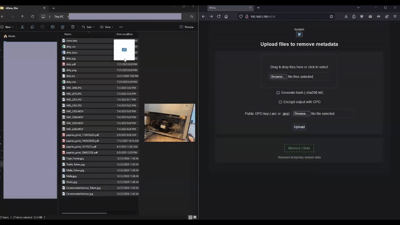

# rMeta v0.4.0 — Clean Your Files, Keep Your Privacy

rMeta is a local-only file metadata scrubber that's fast, secure, and doesn't send your data anywhere **EVER**. Whether you're a journalist, lawyer, researcher, or just someone who wants to keep sensitive files clean, rMeta gives you full control over your privacy.

## Overview

rMeta removes metadata from sensitive files without sending anything over the network. It runs entirely on your machine, inside Docker, and automatically manages its workspace for safety.

You drag a file in, rMeta strips away the noise, and you get a clean version out. No snooping, no nonsense.

- Don't have javascript?  Cool - rMeta only uses it for theme switching.  
- SHA256 hashfile generation
- Optional GPG public key encryption
- Temporary workspace auto-cleans
- **Never** phones home
- Multiple cleanup methods - deletes previous files on startup, shutdown, when you upload new files, and on-demand with handy button control in the webUI.

## Why Should We Care?

This project started when we couldn't find a sole-source piece of kit that could handle multiple filetypes, cost nothing (really), and make us feel comfortable about sharing sensitive files.  We set out to create something:

- **Durable.**  The app's architecture separates concerns, handles validation, and uses ephemeral working directories.
- **Customizable.**  We don't handle files you want?  Write your own handler!
- **Fast.** Asynchronous architecture means rMeta handles multiple files simultaneously - even if there are errors.
- **Smart.** We made sure rMeta does its best to *elegantly* fail while also providing warnings, messages, and logpoints - all accessible by you.
- **Private.** It will **never** send your data anywhere.  Everything is stored in a temporary workspace.  You have full control.
- **Secure.** rMeta can generate SHA256 hashfiles AND use your GPG public key to encrypt files at runtime.

## 🗂️ Supported File Types

- JPEG — In-place metadata scrub

- PDF — Metadata library cleanup

- DOCX — XML-safe stripping

- XLSX — Tag-based metadata removal

- HEIC — Converts to JPEG + scrubs

- TXT / CSV — Minimal metadata check

## Getting Started

Choose the setup that fits your needs. All options run rMeta locally and keep your files private.

### 🟢 Option 1: Quick and Dirty — `docker run`

Fastest way to get started. No setup, no config—just run it:

```bash
docker run --rm -d -p 8574:8574 kitquietdev/rmeta:latest
 ```
_This runs the latest published image on Docker Hub in production mode. No volumes, no persistence._

### 🟡 Option 2: Compose It Right — Using `docker-compose.yml`

More structured. Gives you control over config, ports, volumes, environment variables, etc.

```bash
mkdir rmeta && cd rmeta
curl -O https://gitlab.com/kitquietdev/rMeta/-/raw/main/docker-compose.yml
docker compose up -d
```

_This uses Gunicorn and production settings. Workspace is managed inside the container._

### 🟣 Option 3: Clone + Run — Use the Codebase Directly

If you want the source alongside your container for development, customization, or contributions.

```bash
git clone https://gitlab.com/kitquietdev/rMeta.git
cd rMeta
cp docker-compose.yml.example docker-compose.yml
docker compose up
```
_This runs rMeta in development mode with hot reload and mounted volumes._

*Edit the fresh `docker-compose.yml` as needed for your local dev environment.

### **Do not expose this setup to the internet.**
## ⚠️ Security Warning

rMeta is designed to run locally. Development mode (flask run) is not hardened and should never be exposed to the internet.

- Dev mode lacks production-grade request handling

- It does not sanitize headers or enforce TLS

- It is intended for local testing only

**If you choose to expose rMeta publicly (e.g., via reverse proxy, tunnel, or port forwarding), you are responsible for securing that setup. Future versions will include proxy-awareness and optional TLS support, but v0.3.0 does not.**

## Architecture Overview

- `flask_renderer.py` — Entry point for the app

- `handlers/` — File-type-specific logic

- `postprocessors/` — Optional encryption, hashing, etc.

- `uploads/` — Temporary workspace (auto-managed)

## 🧪 Internal Testing Artifacts

The `dev/` directory contains sample files and scripts used during development. It’s not meant to enforce a test suite — it’s there to illustrate what rMeta was validated against. These assets can help you explore edge cases or understand scrubbing logic in context.

## Simple and Intuitive Workflow



_rMeta Workflow Demo_

Simply drag and drop (or browse) files into rMeta, select your options, and press Upload. Download links appear instantly below. You can clear the workspace at anytime with the intelligent Clean Memory button.


Real-time feedback, smart messaging, and file-level status reporting – all in one lightweight interface.

## 🐳 Docker Compose Files
File	Purpose
- `docker-compose.yml`	Production mode using Gunicorn
- `docker-compose.yml.example`	Development mode with hot reload and mounted volumes

## 📜 License Compliance

rMeta honors all third-party licenses. See [`THIRD_PARTY.md`](https://gitlab.com/kitquietdev/rmeta/-/blob/main/THIRD_PARTY.md) for full attribution.

## Contributing

Want to add support for a new file type? Improve the UI? Suggest a feature? We welcome contributions of all kinds. Modular architecture makes it easy to plug in new logic.

We'd love to have you on but we ask you to maintain the ethos and stay consistent with our novice-friendly/expert-aware goals.  To do so, please see
- [Code of Conduct](https://gitlab.com/kitquietdev/rmeta/-/blob/docs/CODE_OF_CONDUCT.md)

- [Our Contributor's Guide](https://gitlab.com/kitquietdev/rmeta/-/blob/main/docs/CONTRIBUTING.md)

- [Our Documentation Guidelines](https://gitlab.com/kitquietdev/rmeta/-/blob/main/docs/DOCUMENTATION_GUIDELINES.md)

- [Developer's Greeting and Guide](https://gitlab.com/kitquietdev/rmeta/-/blob/main/docs/DEVELOPERS.md)

## Changes and versioning

This README describes the current state of rMeta. For version history and detailed changes, see [`CHANGELOG.md`](https://gitlab.com/kitquietdev/rmeta/-/blob/main/changelog.md).
