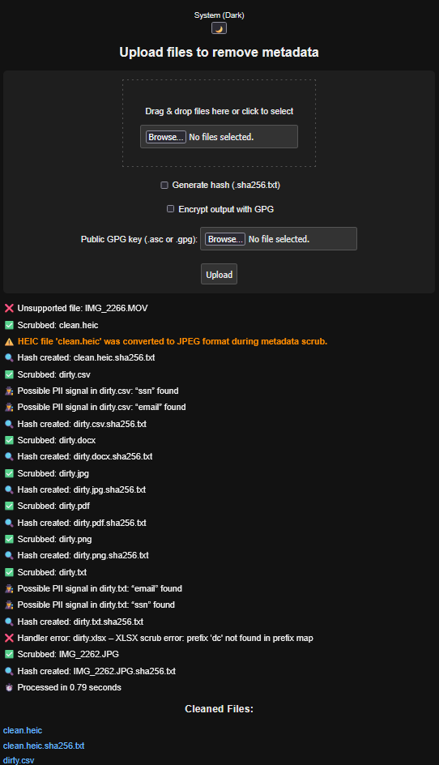

# 🧼 rMeta: Clean Your Files, Keep Your Privacy

rMeta is a metadata scrubber built for people who care about privacy, digital safety, and control over what leaves their machine. It's fast, local-only, and designed for journalists, researchers, lawyers, activists, and honestly anyone who just wants to make sure their documents don’t secretly leak where they’ve been.  It automatically deletes and recreates its workspace for extra safety and it never, **ever** phones anywhere.

You drag a file in, rMeta strips away the noise, and you get a clean version out. No snooping, no nonsense.

*Don't have javascript?*  Cool.  rMeta will still work and won't complain; it just doesn't change themes without it.

rMeta can generate SHA256 hashfiles (.txt format) and can accept GPG public keys to encrypt results.

# 🔍 OK, You Seem Enthusiastic.  Why Should We Care?

This project started when we couldn't find a sole-source piece of kit that could handle multiple filetypes, cost nothing (really), and make us feel comfortable about sharing sensitive files.

We set out to create something:

- **Durable.**  The architecture allows hyper-specialization of each of the three module types (app.py, handlers, and postprocessors).
- **Customizable.**  We don't handle files you want?  Write your own handler!
- **Fast.** Asynchronous architecture means rMeta handles multiple files simultaneously - even if there are errors.
- **Smart.** We made sure rMeta does its best to *elegantly* fail while also providing warnings, messages, and logpoints - all accessible by you.
- **Private.** It will **never** send your data anywhere.  Everything is stored in a temporary workspace.  You have full control.
- **Secure.** rMeta can generate SHA256 hashfiles AND use your GPG public key to encrypt files at runtime.

# 🗂️ File Types Supported

- **JPEG** (Cleaned in-place)
- **PDF** (Uses metadata library)
- **DOCX** (Handles XML content safely)
- **XLSX** (Strips metadata tags cleanly)
- **HEIC** (Converts to JPEG + scrubs)
- **TXT / CSV** (Minimal metadata, but still checked)

# 💡 Why This Matters

We believe privacy shouldn’t require technical gymnastics. That’s why rMeta is designed to work offline, give you full control, and tell you what's happening without burying you in jargon. If you want encryption, you’ve got it. If you want drag-and-drop simplicity, it’s here too.

You shouldn't have to be a cybersecurity expert to stay safe. This tool is built with that philosophy **front and center**.

# 🛠️ Getting Started

You’ll need Docker. Once installed, choose your weapon:

**Pull and run (Prebuilt)**

```bash
docker pull ghcr.io/KitQuietDev/rmeta:latest
docker run -it --rm -p 8574:8574 ghcr.io/KitQuietDev/rmeta:latest
```

**OR Build and run locally**

```bash
# Clone the repository
git clone https://github.com/KitQuietDev/rmeta.git
cd rmeta

# Build the Docker image locally
docker build -t rmeta:local .

# Run the container
docker run -it --rm -p 8574:8574 rmeta:local

```

Open your browser and visit `http://localhost:8574`. Then drop a file into the UI and watch the metadata vanish.

# 🧪 Internal Testing Artifacts

The testing/ directory contains sample files and scripts used during development. It’s not meant to enforce a test suite — it’s there to illustrate what rMeta was validated against. These assets can help you explore edge cases or understand scrubbing logic in context.

# Screenshot



> Real-time feedback, smart messaging, and file-level status reporting – all in one lightweight interface.

# 🌱 Want to Contribute?

We’re modular. Every file type gets its own handler — and if you're adding a new one, there are patterns you can follow to make it clean, testable, and user-friendly.

We're happy to help onboard folks who want to improve the tool or add support for obscure formats. If you write code, great. If you just want to suggest improvements, that’s just as valuable.
